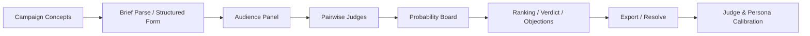

<div align="center">


# MiroFishmoody

**A campaign decision market for Moody Lenses**

Turn campaign review from intuition-only discussion into a workflow that can be compared, tracked, resolved, and calibrated.

[中文](./README.md) | [Changelog](./CHANGELOG.md) | [Deployment Guide](./DEPLOY.md) | [Backend Quickstart](./backend/QUICKSTART.md)

</div>

## Overview

**MiroFishmoody** started as a product fork of [MiroFish](https://github.com/666ghj/MiroFish), but the current branch is now focused on a much narrower and more practical use case: **pre-launch campaign review for Moody Lenses**.

It is built to answer questions like:

- which concept is stronger among multiple campaign options
- which angle is more eye-catching, credible, and audience-fit
- which objections or claim risks may hurt conversion
- whether a concept should be `ship / revise / kill`
- how post-launch outcomes should feed back into model calibration

## Current release

**Documented baseline: `v0.5.0` (2026-03-13)**

This is the first SemVer baseline for the current `moody-main` branch. It consolidates the P0-P3 implementation milestones plus the most recent UI, admin, and review-flow polish.

| Area | Status | Notes |
|------|--------|-------|
| Input layer | Shipped | Brief-first flow, required validation, advanced mode, image upload |
| Evaluation layer | Shipped | Audience panel, pairwise judges, probability aggregation, dimension scoring |
| Task layer | Shipped | Async tasks, progress tracking, task list, persistent results, JSON export |
| Resolution layer | Shipped | Post-launch resolution, judge/persona calibration, readiness messaging |
| Admin layer | Shipped | Login, `admin` role, dashboard and history views |

## What `v0.5.0` includes

| Milestone | Included in `v0.5.0` | Summary |
|-----------|------------------------|---------|
| P0 | Yes | Required validation, brief parsing entry, readable task metadata |
| P1 | Yes | Login system, image upload, campaign-review terminology cleanup |
| P2 | Yes | Orchestrator extraction, market judge flow, probability and dimension fixes |
| P3 | Yes | Task/result persistence, image rendering in results, JSON export |
| Recent polish | Yes | UI redesign, `admin` role, review-flow fixes |

See [CHANGELOG.md](./CHANGELOG.md) for release notes.

## Shipped capabilities

- **Authentication and roles**: `/api/auth/login`, `/logout`, `/me`, plus `admin` and `user` roles.
- **Review creation**: brief mode by default, advanced field mode, multi-campaign inputs, image upload, and pre-submit validation.
- **Async review execution**: returns `task_id` and `set_id`, with live progress tracking in the UI.
- **Persistent outputs**: results are stored on disk and can be reloaded after restart.
- **Resolution and calibration**: supports post-launch settlement, calibration readiness checks, and recalibration.
- **Admin views**: dashboard and history pages for internal review operations.

## Future work

`v0.5.0` is still a **campaign review system**.  
The items below are **future direction**, not shipped capabilities.

Suggested name:

- **Moody Brandiction Engine**

Here, `Brandiction` is a shorthand for `brand + prediction`: a system for betting on brand cognition paths, then resolving and calibrating those bets against reality.

Core capabilities that are **not built yet**:

- `BrandState` modeling
- `Intervention` objects for structured marketing actions
- lightweight audience diffusion simulation
- `MarketContract` pricing for strategic questions
- argument-driven market maker logic
- cognition-path-level resolution and calibration

Draft design note:

- [docs/MOODY_BRANDICTION_ENGINE.md](./docs/MOODY_BRANDICTION_ENGINE.md)

## Workflow



## Quick start

### Prerequisites

| Tool | Version | Purpose |
|------|---------|---------|
| Python | 3.11+ | Backend runtime |
| Node.js | 18+ | Frontend development and build |
| Docker | Latest | Recommended deployment path |
| `uv` | Optional | Backend dependency management |

### Option 1: Docker

```bash
git clone https://github.com/fantasyslr/MiroFishmoody.git
cd MiroFishmoody

cp .env.example .env
# Edit .env and set at least LLM_API_KEY

docker compose up -d --build
```

Open `http://localhost:5001`.

### Option 2: Local development

```bash
git clone https://github.com/fantasyslr/MiroFishmoody.git
cd MiroFishmoody

cp .env.example .env
# Edit .env and set at least LLM_API_KEY

npm run setup
cd backend && uv sync && cd ..

npm run dev
```

Default local endpoints:

- frontend: `http://localhost:5173/#/login`
- backend: `http://localhost:5001`

If you do not use `uv`, you can install the backend with `pip` instead:

```bash
cd backend
pip install -r requirements.txt
python run.py
```

Then start the frontend in another terminal:

```bash
cd frontend
npm install
npm run dev
```

## Authentication and API notes

All `/api/campaign/*` endpoints currently require a logged-in session, except `/health`.  
Local test users live in `backend/app/auth.py`; replace them before public deployment.

### API smoke test

```bash
# 1. Login and store the session cookie
curl -c cookies.txt -X POST http://localhost:5001/api/auth/login \
  -H "Content-Type: application/json" \
  -d '{"username":"<username>","password":"<password>"}'

# 2. List tasks
curl -b cookies.txt http://localhost:5001/api/campaign/tasks

# 3. Submit a review
curl -b cookies.txt -X POST http://localhost:5001/api/campaign/evaluate \
  -H "Content-Type: application/json" \
  -d '{
    "campaigns": [
      {"name": "Plan A", "core_message": "Natural daily disposable color lenses", "product_line": "colored_lenses"},
      {"name": "Plan B", "core_message": "Silicone hydrogel high-oxygen tech", "product_line": "moodyplus"}
    ]
  }'

# 4. Check progress
curl -b cookies.txt http://localhost:5001/api/campaign/evaluate/status/<task_id>

# 5. Fetch results
curl -b cookies.txt http://localhost:5001/api/campaign/result/<set_id>

# 6. Export JSON
curl -b cookies.txt -OJ http://localhost:5001/api/campaign/export/<set_id>

# 7. Submit post-launch resolution
curl -b cookies.txt -X POST http://localhost:5001/api/campaign/resolve \
  -H "Content-Type: application/json" \
  -d '{"set_id":"<set_id>","winner_campaign_id":"campaign_1","actual_metrics":{"ctr":0.03}}'

# 8. Inspect calibration status
curl -b cookies.txt http://localhost:5001/api/campaign/calibration
```

## Repository layout

| Path | Purpose |
|------|---------|
| `frontend/` | React + Vite + TypeScript frontend |
| `backend/` | Flask backend, evaluation logic, resolution, calibration |
| `backend/tests/` | Backend tests for scorer, calibration, and Phase 5.5 / 5.6 behaviors |
| `static/` | Static assets, including the project logo |
| `DEPLOY.md` | Docker / server deployment notes |
| `CHANGELOG.md` | Release notes |

## Tech stack

- **Frontend**: React 19, Vite 8, TypeScript, React Router, Zustand
- **Backend**: Flask, Gunicorn, OpenAI-compatible LLM client
- **Runtime**: local dual-process development or Docker single-port deployment
- **LLM providers**: OpenAI, Alibaba Bailian / Qwen, and other compatible endpoints

## Testing

```bash
cd backend
python -m pytest tests -q
```

## Versioning

Starting with `v0.5.0`, this repo documents public baselines with SemVer.  
Earlier rewrite work still exists in Git history, but is consolidated into the current baseline documentation.

## Acknowledgements

- Original project: [MiroFish](https://github.com/666ghj/MiroFish)
- This fork keeps the multi-perspective review idea, but narrows it into a concrete campaign decision workflow
- License: `AGPL-3.0`
