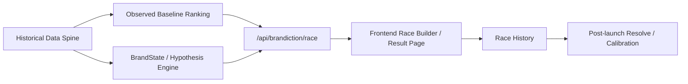

<div align="center">


# MiroFishmoody

**Moody Lenses internal Brandiction Engine v3 alpha**

Turn campaign decision-making from intuition-only debate into an internal race with evidence, boundaries, and a place to resolve what actually happened.

[中文](./README.md) | [Changelog](./CHANGELOG.md) | [Deployment Guide](./DEPLOY.md) | [Backend Quickstart](./backend/QUICKSTART.md)

</div>

## What this is

**This is not a creative scoring toy.**

The more accurate definition is: **MiroFishmoody is now an internal campaign race engine**.

It does four things:

- organizes historical interventions, DTC funnel outcomes, signals, and competitor events into a queryable data spine
- puts multiple campaign plans into the same operating context
- ranks them with **Observed Baseline** first
- keeps `BrandState / diffusion / perception delta` in **Model Hypothesis**

It is designed to answer questions like:

- which plan is more worth backing first
- how much of that recommendation is supported by real historical evidence
- where the evidence is sparse
- how the team can resolve the race after launch instead of starting from scratch every time

## Definition flip

This project used to be described as a “campaign review tool.”  
That is no longer the best frame.

> **It is not replacing judgment. It is constraining judgment.**

Its value is not a magical score.
Its value is forcing one decision into three separate buckets:

- what is **real historical evidence**
- what is **model inference**
- what is **weak evidence**

If those three get blended together, the system creates false certainty.

## Dual-track architecture

| Track | Core question | Data source | Role in the system | Current trust level |
|------|---------------|-------------|--------------------|---------------------|
| **Track 1 · Observed Baseline** | How did similar combinations perform historically? | interventions / outcomes / DTC funnel | **Drives ranking** | current production-facing path |
| **Track 2 · Model Hypothesis** | What cognition shift might this plan create? | BrandState / rules / diffusion | **Explanation and risk context** | experimental |

In short:

- **Baseline decides rank**
- **Hypothesis explains the rank**

## What the codebase does today

### Usable now

- **Data Spine** for `interventions / outcomes / signals / competitor_events / evidence`
- **Baseline Ranking** across `market × platform × channel_family × theme × landing_page`
- **Race API** through `/api/brandiction/race`
- **Race History** through `/api/brandiction/race-history`
- **Frontend Lab** redesigned around “Observed Baseline first, Model Hypothesis second”

### Written into the codebase, but still experimental

- `BrandState`
- `predict / replay / backtest`
- `probability-board`
- `simulate / compare-scenarios`
- `agent diffusion`

### What this repo does **not** honestly claim yet

- it does not replace final human judgment
- it does not reliably forecast exact future ROAS
- it does not claim `confidence` is already a calibrated real-world accuracy score
- it does not claim the perception model is backed by long-horizon brand-tracking data

## Best current use

The current best workflow is:

1. send a batch of plans to `/race`
2. inspect **Observed Baseline** first: sample size, match quality, historical range
3. inspect **Model Hypothesis** second: useful explanation, not authority
4. make an internal ranking or small budget split
5. write back real outcomes through history / resolution later

More bluntly:

> The system is ready to act like a **decision copilot**, not a **decision autopilot**.

## System map



## Main APIs

### Authentication

- `POST /api/auth/login`
- `POST /api/auth/logout`
- `GET /api/auth/me`

Users are now loaded from the `MOODY_USERS` environment variable, not hard-coded in source.

Example:

```bash
export MOODY_USERS="admin:your-password:Admin:admin,user1:your-password:User One:user"
```

### Brandiction mainline

| Endpoint | Purpose | Access |
|----------|---------|--------|
| `POST /api/brandiction/import-history` | import JSON historical data | `admin` |
| `POST /api/brandiction/import-csv` | import CSV (`interventions` / `outcomes`) | `admin` |
| `GET /api/brandiction/interventions` | query historical interventions | login |
| `GET /api/brandiction/signals` | query brand signals | login |
| `GET /api/brandiction/competitor-events` | query competitor events | `admin` |
| `GET /api/brandiction/stats` | inspect data-spine readiness | `admin` |
| `POST /api/brandiction/race` | run a dual-track race | login |
| `GET /api/brandiction/race-history` | inspect race history | login |
| `POST /api/brandiction/race-history/<run_id>/resolve` | resolve whether a recommendation hit | `admin` |

### Experimental APIs

These are already in the repo, but should still be treated as experimental:

- `GET /api/brandiction/brand-state`
- `GET /api/brandiction/brand-state/latest`
- `POST /api/brandiction/brand-state/build`
- `POST /api/brandiction/replay`
- `POST /api/brandiction/predict`
- `POST /api/brandiction/probability-board`
- `POST /api/brandiction/backtest`
- `POST /api/brandiction/simulate`
- `POST /api/brandiction/compare-scenarios`

## Quick start

### Prerequisites

| Tool | Version | Purpose |
|------|---------|---------|
| Python | 3.11+ | backend runtime |
| Node.js | 18+ | frontend development and build |
| Docker | latest | optional deployment path |
| `uv` | recommended | backend dependency management |

### Local development

```bash
git clone https://github.com/fantasyslr/MiroFishmoody.git
cd MiroFishmoody

cp .env.example .env
# configure .env as needed

export MOODY_USERS="admin:your-password:Admin:admin"

npm run setup
npm run setup:backend
npm run dev
```

Default local URLs:

- frontend: `http://localhost:5173`
- backend: `http://localhost:5001`

### Docker

```bash
git clone https://github.com/fantasyslr/MiroFishmoody.git
cd MiroFishmoody

cp .env.example .env
export MOODY_USERS="admin:your-password:Admin:admin"

docker compose up -d --build
```

## API smoke test

```bash
# 1. Login and store the session cookie
curl -c cookies.txt -X POST http://localhost:5001/api/auth/login \
  -H "Content-Type: application/json" \
  -d '{"username":"admin","password":"your-password"}'

# 2. Run a race
curl -b cookies.txt -X POST http://localhost:5001/api/brandiction/race \
  -H "Content-Type: application/json" \
  -d '{
    "product_line": "moodyplus",
    "audience_segment": "general",
    "market": "cn",
    "sort_by": "roas_mean",
    "include_hypothesis": true,
    "plans": [
      {
        "name": "Science Plan",
        "theme": "science_credibility",
        "platform": "redbook",
        "channel_family": "social_seed",
        "budget": 50000,
        "market": "cn"
      },
      {
        "name": "Comfort Plan",
        "theme": "comfort_beauty",
        "platform": "douyin",
        "channel_family": "short_video",
        "budget": 50000,
        "market": "cn"
      }
    ]
  }'

# 3. Inspect race history
curl -b cookies.txt http://localhost:5001/api/brandiction/race-history
```

## Repository layout

| Path | Purpose |
|------|---------|
| `frontend/` | React + Vite + TypeScript strategy lab |
| `backend/app/api/brandiction.py` | Brandiction main API |
| `backend/app/services/baseline_ranker.py` | Track 1 historical baseline ranking |
| `backend/app/services/brand_state_engine.py` | Track 2 hypothesis engine |
| `backend/app/services/agent_diffusion.py` | lightweight diffusion simulation |
| `backend/app/services/brandiction_store.py` | SQLite data spine |
| `backend/tests/` | backend test suite |
| `static/` | static assets including the logo |

## Run and test

```bash
# Backend tests
cd backend
python -m pytest tests -q

# Frontend lint / build
cd ../frontend
npm run lint
npm run build
```

## Version note

The package version is still `0.5.0`, but the current branch has already moved into a **Brandiction Engine v3 alpha** product direction.

That means:

- `v0.5.0` is still the published baseline number
- the current working tree is already shaped around the newer dual-track race model

If you want a cleaner public release label, it should probably happen after the `race + history + resolve + data spine` path stabilizes further.

## Legacy note

Older `/api/campaign/*` flows still exist in the repo.  
They are no longer the main story of this README, but they have not been hard-deleted.

If you need the earlier “campaign review workflow” framing, check Git history and earlier release notes.

## Acknowledgements

- Original project: [MiroFish](https://github.com/666ghj/MiroFish)
- This branch has since narrowed from broad social-simulation ambition into a more concrete brand decision system
- License: `AGPL-3.0`
