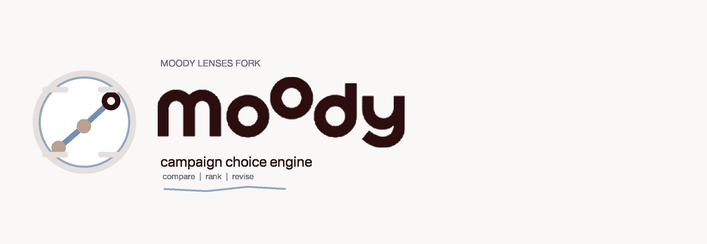

# MiroFishmoody

**A campaign choice engine fork being rebuilt for Moody Lenses**

Shifting from "predict anything" social simulation to a pre-launch decision system for e-commerce campaigns.

[English](./README-EN.md) | [中文](./README.md)

## Positioning

**MiroFishmoody** is a product fork of [MiroFish](https://github.com/666ghj/MiroFish), rebuilt around a narrower and more practical goal:

- compare multiple campaign concepts before launch
- identify which angle is more likely to win
- turn intuition-heavy creative debates into structured evaluation

This project is not trying to answer "what will the future be?"

It is trying to answer:

- which concept is stronger among `A / B / C`
- which option is more eye-catching, credible, and audience-fit
- which objections or claim risks are likely to hurt conversion
- whether a concept should be `ship / revise / kill`

## Why this fork exists

Most early e-commerce campaign decisions still rely on taste, confidence, and internal persuasion:

- "this one looks better"
- "I think users will like this"
- "this angle feels stronger"

That is not reliable enough.

For Moody, the real need is a **campaign choice engine**:

- not a fake ROAS / GMV oracle
- not a single operator's judgment disguised as strategy
- not a giant simulation world for its own sake
- but a system that increases the odds of choosing the better concept before money is spent

## Moody business context

This fork is being shaped around **Moody Lenses**:

- two product lines: `colored lenses` and `moodyPlus`
- the brand competes on `function + aesthetics`, not discount-led messaging
- `moodyPlus` is aimed at existing contact lens wearers who care about natural effect, comfort, and eye-health confidence
- the system is intended to help pre-screen concepts before real Meta, Google, landing page, and creator testing

## What the engine is meant to evaluate

The decision logic should prioritize **relative ranking**, not absolute forecasting.

Core evaluation dimensions:

- Hook strength
- Visual / aesthetic pull
- Message clarity
- Trust and claim believability
- Audience fit
- Objection pressure
- Brand risk

Expected outputs:

- ranking
- pairwise comparison
- audience-specific feedback
- objections and revision directions
- `ship / revise / kill`

## Rewrite direction

The rewrite is intentionally opinionated.

**Keep**

- multi-agent / multi-perspective review
- pairwise concept comparisons
- structured decision summaries

**Remove**

- Zep graph dependencies
- GraphRAG
- Twitter / Reddit world simulation
- long-running social environment modeling
- the broad "predict anything" framing

**Rebuild**

- audience panel
- pairwise judge engine
- campaign scoring
- summary generation
- calibration layer later on

## Current status

This repository is an **active public rewrite**.

The direction is clear, but the fork is still being tightened into a focused campaign evaluator. The current public branch should be read as:

> a Moody-facing campaign decision system in transition, not a simple reskin of the original MiroFish.

The immediate priorities are:

1. align the public narrative with the real product direction
2. continue syncing code cleanup and evaluator-focused refactors
3. converge on a pre-launch campaign review workflow that is actually usable

## Intended workflow

The long-term workflow is straightforward:

1. submit multiple campaign concepts
2. choose product line and target audience
3. run audience panel reviews
4. run pairwise judge comparisons
5. generate ranking, objections, summary, and action recommendation

## Intended use cases

- Meta campaign angle pre-screening
- creative direction comparison
- landing page angle comparison
- influencer script review
- product-line-specific evaluation for `colored lenses` and `moodyPlus`

## What this is not

This should not be treated as:

- a profit prediction engine
- an attribution system replacement
- a media buying system
- a magical certainty machine

It is first and foremost a **better campaign selection tool**.

## Credits

- Original project: [MiroFish](https://github.com/666ghj/MiroFish)
- The original multi-agent simulation direction provided the starting point for this fork

Future code and documentation updates will continue to narrow the repo around the **Moody Lenses campaign choice engine** direction.
