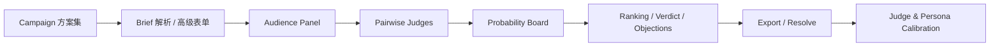

<div align="center">


# MiroFishmoody

**Moody Lenses 内部 campaign 决策市场**

把 campaign 评审从“拍脑袋讨论”升级成可对比、可追踪、可结算、可校准的内部决策流程。

[English](./README-EN.md) | [更新日志](./CHANGELOG.md) | [部署说明](./DEPLOY.md) | [后端快速试用](./backend/QUICKSTART.md)

</div>

## 项目概览

**MiroFishmoody** 是基于 [MiroFish](https://github.com/666ghj/MiroFish) 重构出的产品化分支，但当前主线已经明确收敛到 **Moody Lenses 的 pre-launch campaign review** 场景。

它不做“预测万物”，而是解决更具体的问题：

- 多个 campaign 方案里谁更值得先上
- 哪个 angle 更抓眼球、更可信、更匹配受众
- 哪些 objection、claim 风险和表达问题会拖垮转化
- 当前方案应该 `ship / revise / kill`
- 赛后如何把真实结果回写进系统，校准判断质量

## 当前版本

**当前文档基线：`v0.5.0`（2026-03-13）**

这是 `moody-main` 当前可运行版本的首个 SemVer 基线，汇总了 P0-P3 功能实现，以及最近的 UI、后台和评审流程修整。

| 模块 | 状态 | 说明 |
|------|------|------|
| 输入层 | 已上线 | Brief 模式、必填校验、高级模式、多方案输入、图片上传 |
| 评审层 | 已上线 | Audience panel、pairwise judge、概率聚合、维度评分、总结输出 |
| 任务层 | 已上线 | 异步任务、进度查询、任务列表、结果持久化、JSON 导出 |
| 复盘层 | 已上线 | 结算、judge/persona calibration、阈值提示、历史回看 |
| 管理层 | 已上线 | 登录态、`admin` 角色、后台总览与历史页面 |

## `v0.5.0` 具体包含什么

| 里程碑 | 已纳入 `v0.5.0` | 内容 |
|--------|------------------|------|
| P0 | 是 | 必填校验、Brief 解析入口、任务列表信息可读化 |
| P1 | 是 | 登录系统、图片上传、术语收敛到 campaign review 语境 |
| P2 | 是 | orchestrator 抽离、market judge、概率修正、维度分数 |
| P3 | 是 | 任务与结果持久化、结果页素材展示、JSON 导出 |
| Recent polish | 是 | UI 重设计、`admin` 角色、评审流程修复 |

详细更新见 [CHANGELOG.md](./CHANGELOG.md)。

## 已实现功能

- **登录与角色**：提供 `/api/auth/login`、`/logout`、`/me`，支持 `admin` / `user` 角色。
- **新建评审**：默认 Brief 模式，可切换高级字段模式；支持多方案输入、图片上传、提交前校验。
- **异步评审**：提交后返回 `task_id` 和 `set_id`，可在运行页或后台持续追踪进度。
- **结果沉淀**：完整结果会落盘保存，支持服务重启后重新读取与导出。
- **结算与校准**：支持赛后 resolution、judge/persona calibration 状态查询与再校准。
- **后台视图**：管理员可以在总览台和历史页查看任务、结果和校准状态。

## 以后会做

当前 `v0.5.0` 还不是“品牌认知下注系统”，它仍然是 **campaign review system**。  
下面这部分属于 **big picture / future work**，不是当前已交付能力。

这条线我建议统一叫：

- **Moody Brandiction Engine**

`Brandiction` 这里是 `brand + prediction` 的组合词，用来表示“围绕品牌认知路径做判断、下注、结算和校准”的系统。

这个方向 **现在还没做** 的核心能力包括：

- `BrandState`：品牌认知状态建模
- `Intervention`：把推广动作建成可模拟的干预对象
- 轻量用户扩散仿真：评论、种草、质疑、二次传播
- `MarketContract`：把战略问题改成可定价、可结算的命题
- argument-driven market maker：多空论据对打后更新价格
- 认知路径级别的 resolution 与 calibration

未来方向设计稿见 [docs/MOODY_BRANDICTION_ENGINE.md](./docs/MOODY_BRANDICTION_ENGINE.md)。

## 系统流程



## 快速开始

### 前置要求

| 工具 | 版本 | 用途 |
|------|------|------|
| Python | 3.11+ | 后端运行环境 |
| Node.js | 18+ | 前端开发与构建 |
| Docker | 最新版 | 推荐部署方式 |
| `uv` | 可选 | 本地后端依赖管理 |

### 方式一：Docker 运行

```bash
git clone https://github.com/fantasyslr/MiroFishmoody.git
cd MiroFishmoody

cp .env.example .env
# 编辑 .env，至少填入 LLM_API_KEY

docker compose up -d --build
```

打开 `http://localhost:5001`。

### 方式二：本地开发

```bash
git clone https://github.com/fantasyslr/MiroFishmoody.git
cd MiroFishmoody

cp .env.example .env
# 编辑 .env，至少填入 LLM_API_KEY

npm run setup
cd backend && uv sync && cd ..

npm run dev
```

默认会同时启动：

- 前端：`http://localhost:5173/#/login`
- 后端：`http://localhost:5001`

如果你不用 `uv`，也可以改成：

```bash
cd backend
pip install -r requirements.txt
python run.py
```

然后另开一个终端启动前端：

```bash
cd frontend
npm install
npm run dev
```

## 认证与 API 说明

除 `/health` 外，当前 `/api/campaign/*` 接口都要求登录态 Session。  
本地测试账号定义在 `backend/app/auth.py`，正式部署前请替换成自己的账号配置或接入真实认证。

### API 冒烟示例

```bash
# 1. 登录并保存 Cookie
curl -c cookies.txt -X POST http://localhost:5001/api/auth/login \
  -H "Content-Type: application/json" \
  -d '{"username":"<username>","password":"<password>"}'

# 2. 查看任务列表
curl -b cookies.txt http://localhost:5001/api/campaign/tasks

# 3. 提交评审
curl -b cookies.txt -X POST http://localhost:5001/api/campaign/evaluate \
  -H "Content-Type: application/json" \
  -d '{
    "campaigns": [
      {"name": "方案A", "core_message": "自然美瞳日抛新体验", "product_line": "colored_lenses"},
      {"name": "方案B", "core_message": "硅水凝胶透氧黑科技", "product_line": "moodyplus"}
    ]
  }'

# 4. 查询进度
curl -b cookies.txt http://localhost:5001/api/campaign/evaluate/status/<task_id>

# 5. 获取结果
curl -b cookies.txt http://localhost:5001/api/campaign/result/<set_id>

# 6. 导出 JSON
curl -b cookies.txt -OJ http://localhost:5001/api/campaign/export/<set_id>

# 7. 赛后结算
curl -b cookies.txt -X POST http://localhost:5001/api/campaign/resolve \
  -H "Content-Type: application/json" \
  -d '{"set_id":"<set_id>","winner_campaign_id":"campaign_1","actual_metrics":{"ctr":0.03}}'

# 8. 查看校准状态
curl -b cookies.txt http://localhost:5001/api/campaign/calibration
```

## 仓库结构

| 路径 | 说明 |
|------|------|
| `frontend/` | React + Vite + TypeScript 前端 |
| `backend/` | Flask 后端、评审逻辑、结算与校准服务 |
| `backend/tests/` | 后端测试，覆盖评分、校准、Phase 5.5/5.6 行为 |
| `static/` | 静态资源，包括项目 logo |
| `DEPLOY.md` | Docker / 服务器部署说明 |
| `CHANGELOG.md` | 版本更新记录 |

## 技术栈

- **前端**：React 19、Vite 8、TypeScript、React Router、Zustand
- **后端**：Flask、Gunicorn、OpenAI-compatible LLM client
- **运行方式**：本地双端开发或 Docker 单端口部署
- **LLM 接口**：OpenAI、百炼 / 千问等兼容接口

## 测试

```bash
cd backend
python -m pytest tests -q
```

## 版本策略

从 `v0.5.0` 开始，仓库文档按 SemVer 记录公开版本基线。  
更早的重构提交仍保留在 Git 历史中，但统一收敛到当前基线版本说明里。

## 致谢

- 原始项目：[MiroFish](https://github.com/666ghj/MiroFish)
- 本项目沿用多视角评审与结构化比较思路，但已经收敛到更明确的 campaign decision workflow
- License：`AGPL-3.0`
