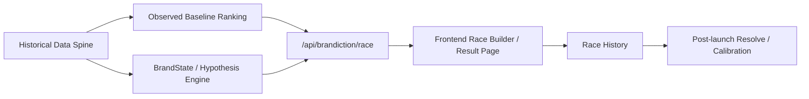

<div align="center">


# MiroFishmoody

**Moody Lenses 内部 Brandiction Engine v3 alpha**

把 campaign 决策从“主观拍板”改成一场有证据、有边界、有复盘入口的内部赛马。

[English](./README-EN.md) | [更新日志](./CHANGELOG.md) | [部署说明](./DEPLOY.md) | [后端快速试用](./backend/QUICKSTART.md)

</div>

## 这是什么

**这不是一个素材打分器。**

更准确地说，**MiroFishmoody 现在是一套内部 campaign race engine**：

- 先把历史投放、独立站漏斗、signals、竞品事件整理成可查询的数据脊柱
- 再把多个 campaign plan 放进同一个上下文里做赛马
- 排名优先由 **Observed Baseline** 决定
- `BrandState / diffusion / perception delta` 只作为 **Model Hypothesis**
- 最终把这次判断和后续真实结果沉淀到同一个历史档案里

它解决的问题不是“预测万物”，而是更具体的：

- 这次 3 到 5 个计划里，哪条更值得先押
- 这个结论到底是有多少历史样本撑着，还是只是弱证据
- 哪些方向是历史强、模型弱，哪些是历史弱、但值得小预算试错
- 赛后怎么把真实结果回填，而不是每次重新靠感觉开始

## 定义翻转

过去我们把这类系统叫“campaign review tool”。  
现在更好的定义是：

> **它不是在替人做判断。它是在约束判断。**

它的价值，不是给你一个“神奇分数”；  
而是把一次 campaign 决策拆成：

- 什么是**真实历史证据**
- 什么是**模型推断**
- 什么是**证据不足**

这三件事如果不拆开，系统只会制造虚假的确定感。

## 双轨架构

| 轨道 | 核心问题 | 数据来源 | 在系统里的角色 | 当前可信度 |
|------|----------|----------|----------------|------------|
| **Track 1 · Observed Baseline** | 历史上类似组合表现如何 | intervention / outcome / DTC funnel | **决定排名** | 当前主链，可内部使用 |
| **Track 2 · Model Hypothesis** | 这条路可能推动什么认知变化 | BrandState / rules / diffusion | **解释与风险提示** | 实验层，不直接拍板 |

一句话说：

- **Baseline 决定谁排前面**
- **Hypothesis 解释为什么它会排这里**

## 当前代码做到哪里

### 已经可用的部分

- **Data Spine**：支持导入和查询 `interventions / outcomes / signals / competitor_events / evidence`
- **Baseline Ranking**：支持按 `market × platform × channel_family × theme × landing_page` 查历史相似组并排序
- **Race API**：支持 `/api/brandiction/race` 输出双轨结果
- **Race History**：支持 `/api/brandiction/race-history` 保存、查看、结算历史赛马记录
- **Frontend Lab**：新的前端已经按“Observed Baseline first, Model Hypothesis second”重做

### 已经写进代码，但仍属实验层的部分

- `BrandState`
- `predict / replay / backtest`
- `probability-board`
- `simulate / compare-scenarios`
- `agent diffusion`

### 这套系统现在**不声称**自己能做到的事

- 不声称自己已经能替代人的最终判断
- 不声称自己能可靠预测下季度的精确 ROAS
- 不声称 `confidence` 已经等同于现实世界准确率
- 不声称 perception 模型已经被长期 brand tracking 校准

## 现在最适合怎么用

当前最合理的用法是：

1. 把一组待投 plans 放进 `/race`
2. 看 **Observed Baseline** 的样本量、match quality 和历史区间
3. 再看 **Model Hypothesis** 有没有提供值得注意的认知线索
4. 先做内部排序和小预算分配
5. 赛后回填真实结果，沉淀到 `race-history`

更直白一点：

> 这套系统现在适合做 **decision copilot**，不适合做 **decision autopilot**。

## 核心流程



## 主要 API

### 认证

- `POST /api/auth/login`
- `POST /api/auth/logout`
- `GET /api/auth/me`

登录账号从环境变量 `MOODY_USERS` 读取，不再写死在代码里。

格式：

```bash
export MOODY_USERS="admin:your-password:Admin:admin,user1:your-password:User One:user"
```

### Brandiction 主线

| Endpoint | 用途 | 权限 |
|----------|------|------|
| `POST /api/brandiction/import-history` | 导入 JSON 历史数据 | `admin` |
| `POST /api/brandiction/import-csv` | 导入 CSV（`interventions` / `outcomes`） | `admin` |
| `GET /api/brandiction/interventions` | 查询历史 interventions | login |
| `GET /api/brandiction/signals` | 查询品牌信号 | login |
| `GET /api/brandiction/competitor-events` | 查询竞品事件 | `admin` |
| `GET /api/brandiction/stats` | 查看数据脊柱覆盖情况 | `admin` |
| `POST /api/brandiction/race` | 运行一轮双轨赛马 | login |
| `GET /api/brandiction/race-history` | 查看历史赛马记录 | login |
| `POST /api/brandiction/race-history/<run_id>/resolve` | 标记赛后命中与否 | `admin` |

### 实验层 API

这些已经在代码里，但建议按实验能力理解：

- `GET /api/brandiction/brand-state`
- `GET /api/brandiction/brand-state/latest`
- `POST /api/brandiction/brand-state/build`
- `POST /api/brandiction/replay`
- `POST /api/brandiction/predict`
- `POST /api/brandiction/probability-board`
- `POST /api/brandiction/backtest`
- `POST /api/brandiction/simulate`
- `POST /api/brandiction/compare-scenarios`

## 快速开始

### 前置要求

| 工具 | 版本 | 用途 |
|------|------|------|
| Python | 3.11+ | 后端运行环境 |
| Node.js | 18+ | 前端开发与构建 |
| Docker | 最新版 | 可选部署方式 |
| `uv` | 推荐 | 后端依赖管理 |

### 本地开发

```bash
git clone https://github.com/fantasyslr/MiroFishmoody.git
cd MiroFishmoody

cp .env.example .env
# 按需配置 .env

export MOODY_USERS="admin:your-password:Admin:admin"

npm run setup
npm run setup:backend
npm run dev
```

默认地址：

- 前端：`http://localhost:5173`
- 后端：`http://localhost:5001`

### Docker

```bash
git clone https://github.com/fantasyslr/MiroFishmoody.git
cd MiroFishmoody

cp .env.example .env
export MOODY_USERS="admin:your-password:Admin:admin"

docker compose up -d --build
```

## API 冒烟示例

```bash
# 1. 登录并保存 Cookie
curl -c cookies.txt -X POST http://localhost:5001/api/auth/login \
  -H "Content-Type: application/json" \
  -d '{"username":"admin","password":"your-password"}'

# 2. 跑一轮 race
curl -b cookies.txt -X POST http://localhost:5001/api/brandiction/race \
  -H "Content-Type: application/json" \
  -d '{
    "product_line": "moodyplus",
    "audience_segment": "general",
    "market": "cn",
    "sort_by": "roas_mean",
    "include_hypothesis": true,
    "plans": [
      {
        "name": "Science Plan",
        "theme": "science_credibility",
        "platform": "redbook",
        "channel_family": "social_seed",
        "budget": 50000,
        "market": "cn"
      },
      {
        "name": "Comfort Plan",
        "theme": "comfort_beauty",
        "platform": "douyin",
        "channel_family": "short_video",
        "budget": 50000,
        "market": "cn"
      }
    ]
  }'

# 3. 查看 race 历史
curl -b cookies.txt http://localhost:5001/api/brandiction/race-history
```

## 仓库结构

| 路径 | 说明 |
|------|------|
| `frontend/` | React + Vite + TypeScript 前端实验室 |
| `backend/app/api/brandiction.py` | Brandiction 主 API |
| `backend/app/services/baseline_ranker.py` | Track 1：历史基线排序 |
| `backend/app/services/brand_state_engine.py` | Track 2：状态与假设引擎 |
| `backend/app/services/agent_diffusion.py` | 轻量 diffusion 仿真 |
| `backend/app/services/brandiction_store.py` | SQLite 数据脊柱 |
| `backend/tests/` | 后端测试集 |
| `static/` | 静态资源，包括 logo |

## 运行与测试

```bash
# 后端测试
cd backend
python -m pytest tests -q

# 前端 lint / build
cd ../frontend
npm run lint
npm run build
```

## 版本说明

包版本当前仍是 `0.5.0`，但当前主分支的产品叙事已经进入 **Brandiction Engine v3 alpha** 阶段。  
这意味着：

- `v0.5.0` 仍然是已发布基线版本号
- 当前仓库里的代码和前端交互，已经明显朝 v3 双轨架构演进

更正式的版本收口，建议等这条 `race + history + resolve + data spine` 主线稳定后再打。

## Legacy 说明

仓库里仍保留较早的 `/api/campaign/*` 能力和相关代码。  
它们不是当前 README 的主叙事重点，但并没有被强行删掉。

如果你要看更早期的“campaign review workflow”定义，可参考 Git 历史和旧版 changelog 说明。

## 致谢

- 原始项目：[MiroFish](https://github.com/666ghj/MiroFish)
- 当前分支已经从广义 social simulation 叙事，收敛到更具体的品牌决策系统
- License：`AGPL-3.0`
