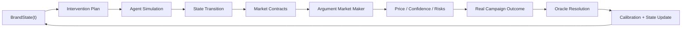

# Moody Brandiction Engine

副标题：把 campaign 评审系统升级成品牌认知下注系统

## 这份文档是干什么的

这不是当前 `v0.5.0` 已上线能力说明，而是 **MiroFishmoody 的下一阶段产品方向**。

这里写的是 **以后会做的 big picture**，不是当前代码已经交付的能力。

当前版本已经能做：

- 多方案 campaign 评审
- 概率聚合
- 结果导出
- 赛后结算
- judge / persona calibration

下一阶段要做的，不再只是回答“哪个 campaign 更好”，而是回答：

- 我现在应该把预算押在哪条品牌认知路径上？
- 哪种推广动作会改变用户对 Moody 的理解？
- 这种认知变化在 6 周、3 个月、6 个月后会如何反过来影响转化？
- 当竞品、平台环境、用户讨论一起变化时，最值得下注的方向是什么？

## 名字说明

**Brandiction = brand + prediction**

这个词的意思不是“品牌算命”，而是：

- 围绕品牌认知路径做预测
- 围绕推广动作下注
- 用真实市场结果来结算和校准

## 一句话定义

**Moody Brandiction Engine** 是一个面向电商品牌的反身性决策系统。

它把品牌看作一个会被自身营销行为不断改变的动态系统，把每一次推广决策看作一次下注，并通过仿真、市场定价、赛后结算和持续校准，让团队更系统地决定“接下来该把筹码押在哪里”。

## 为什么这件事值得做

普通投放工具擅长回答：

- 哪个素材 CTR 更高
- 哪个落地页 CVR 更好
- 哪个定向组合更便宜

但它们很难回答：

- 下个季度该强化“专业眼健康”还是“好看又舒服”认知？
- 先投教育向内容再投转化向内容，是否优于直接转化？
- 竞品下个月打价格战时，我们该跟价还是继续做差异化？

这类问题的共同点是：

- 时间跨度更长
- 依赖品牌认知状态变化
- 推广行为本身会改变环境
- 单次 A/B test 无法回答

这正是反身性、仿真、预言机和做市机制能咬合起来的地方。

## 四块能力怎么拼成一个系统

### 1. 反身性：品牌认知是动态状态

系统首先维护一个 `BrandState`，表示某一时刻目标人群对品牌的认知结构。

它不是静态标签，而是一组持续变化的状态变量，例如：

- `aesthetic_affinity`
- `comfort_trust`
- `science_credibility`
- `price_sensitivity`
- `social_proof`
- `skepticism`
- `competitor_pressure`

每一次推广行为，都会推动 `BrandState(t) -> BrandState(t+1)`。

### 2. MiroFish 式仿真：行动如何改变人群与传播

系统需要一个轻量仿真层，去模拟 campaign 进入环境后会发生什么。

这里不是简单的 5 个 persona 打分，而是至少要模拟：

- 不同消费者类型看到内容后的第一反应
- 他们是否转化、收藏、评论、转发、种草
- 评论区和社交传播如何影响后续用户
- 竞品动作和平台环境如何改变传播效果

不需要上千 agent 的重型模拟，但需要足够捕捉：

- 认知扩散
- 社会证明
- 质疑与反驳
- 内容二次传播

一个现实的起点是：

- 50-100 个 agent
- 5-10 轮交互
- 基于真实用户语料初始化

### 3. 预言机 / prediction market：把战略判断转成可下注的命题

仿真不是目的，下注命题才是目的。

系统需要把模糊讨论改写成可定价、可结算的问题，比如：

- “6 周内 `science_credibility` 提升至少 8pp 的概率是多少？”
- “教育向内容优先的 90 天累计 ROI 超过直接转化向的概率是多少？”
- “竞品降价 20% 后，坚持差异化路线优于跟价路线的概率是多少？”

这些命题就是 `MarketContract`。

### 4. 做市商：让概率在多空论据中收敛

系统不能只输出一次性概率，还要有一个会被对抗性论据持续修正的市场层。

典型流程：

1. 仿真层给出初始价格
2. Bull agent 提出支持论据
3. Bear agent 提出反方论据
4. Market maker 根据论据更新价格
5. 继续迭代直到价格和不确定性收敛

最终输出的不是“分数”，而是：

- 当前价格
- 支持该价格的主要论据
- 最强反方论据
- 对哪些变量最敏感
- 下一步最值得验证的观测点

## 系统蓝图

## 核心领域模型

建议下一阶段围绕下面这些对象建模：

### `BrandState`

表示某个时间点品牌在不同人群中的认知状态。

建议字段：

- `brand_id`
- `as_of_date`
- `audience_segment`
- `perception_vector`
- `evidence_sources`
- `confidence`

### `Intervention`

表示一次准备下注的品牌动作，不限于单个素材。

建议字段：

- `intervention_id`
- `theme`
- `product_line`
- `message_arc`
- `channel_mix`
- `budget_range`
- `duration_window`
- `target_segments`

### `SimulationRun`

表示一次基于当前状态和 intervention 的仿真。

建议字段：

- `run_id`
- `brand_state_id`
- `intervention_id`
- `agent_population_snapshot`
- `round_count`
- `state_delta`
- `emergent_risks`
- `trace_summary`

### `MarketContract`

表示一个可定价、可结算的问题。

建议字段：

- `contract_id`
- `question`
- `settlement_window`
- `resolution_rule`
- `linked_intervention_id`
- `linked_metrics`

### `MarketPrice`

表示合约当前价格及其论据结构。

建议字段：

- `contract_id`
- `current_probability`
- `bull_case`
- `bear_case`
- `key_drivers`
- `uncertainty_sources`
- `market_depth_summary`

### `ResolutionEvent`

表示投放后的真实结算。

建议字段：

- `contract_id`
- `resolved_at`
- `observed_metrics`
- `resolution_value`
- `notes`

## 当前代码哪些能复用

这条线不是推倒重来，现有代码里有几块非常值得保留：

### 1. 编排器可以升级成总控制平面

[evaluation_orchestrator.py](/Users/slr/MiroFishmoody/backend/app/services/evaluation_orchestrator.py) 现在已经负责串联 panel、judge、scoring、summary。  
未来可以扩成：

- `BrandState` 加载
- 仿真层执行
- 市场定价
- 导出战略建议

### 2. 概率聚合器可以升级成价格引擎

[probability_aggregator.py](/Users/slr/MiroFishmoody/backend/app/services/probability_aggregator.py) 现在做的是 panel + pairwise 信号融合。  
未来可以把输入换成：

- 仿真先验
- bull / bear 论据权重
- 历史校准权重
- 合约级价格更新

### 3. 结算层已经有雏形

[resolution_tracker.py](/Users/slr/MiroFishmoody/backend/app/services/resolution_tracker.py) 已经处理真实结果回写。  
未来需要从“哪个 campaign 赢了”升级到“某个战略命题是否发生”。

### 4. calibration 逻辑方向正确

[judge_calibration.py](/Users/slr/MiroFishmoody/backend/app/services/judge_calibration.py) 已经具备：

- 保存预测
- 记录结算
- 重算权重
- 下次评审引用权重

未来只需要把校准对象从 `judge/persona` 扩展到：

- simulation policy
- segment model
- market maker
- contract forecaster

## 当前还没做的

下面这些能力在当前仓库里 **还没有真正实现**：

- `BrandState` 持久化与更新
- 干预后的状态转移模型
- 带社交扩散的轻量 agent 仿真
- 战略问题级别的 `MarketContract`
- bull / bear 对抗后更新价格的 market maker
- 认知路径级别的结算对象

当前已经实现的仍然是：

- campaign 方案输入
- audience / pairwise 评审
- 概率聚合
- 结果导出
- 赛后结算
- judge / persona calibration

## 第一阶段不要做太大

最危险的路线是“一步到位做通用电商世界模型”。  
第一阶段应该非常窄。

建议第一阶段只做：

- 单品牌：`Moody`
- 单产品线：`moodyPlus`
- 单战略张力：`专业眼健康` vs `好看又舒服`
- 单时间窗：`6-8 周`
- 单结算集合：品牌认知 lift + 搜索词变化 + 评论语义 + CTR/CVR

第一阶段系统只需要回答一个问题：

**“今天我该把预算押在 `science credibility` 还是 `comfort + beauty` 这条认知路径上？”**

只要这个问题能形成闭环，系统就成立了。

## 推荐的分阶段路线

### Phase A：认知下注版 market review

目标：先把“评 campaign”升级成“评认知方向”。

要做的事：

- 把输入从 campaign 草案扩成 `Intervention`
- 把输出从 ranking 扩成 `认知路径概率板`
- 增加 `BrandState` 初始快照
- 允许结算“认知目标是否达成”

### Phase B：轻量仿真层

目标：加入真实的状态转移，而不是静态判断。

要做的事：

- 建立 agent population
- 加入评论 / 种草 / 质疑 / 二次传播
- 输出 `BrandState delta`

### Phase C：合约化市场

目标：把关键问题改写成可定价合约。

要做的事：

- 引入 `MarketContract`
- 引入 bull / bear agents
- 实现 argument-driven price update

### Phase D：长期校准

目标：让系统从“有意思”变成“越来越准”。

要做的事：

- 系统化录入真实投放后数据
- 更新状态模型
- 更新仿真策略权重
- 更新市场参与者权重

## 风险和前提

### 风险 1：agent 不贴近真实用户

如果 agent 只是拍脑袋写 persona，仿真结果会非常脆弱。

最低要求：

- 消费者访谈
- 小红书评论语料
- 客服咨询记录
- 投放评论区数据

### 风险 2：没有持续回灌真实结果

这个系统的生命线不是“初始 prompt 写得多厉害”，而是持续结算。

没有 resolution feed：

- `BrandState` 会漂移
- calibration 会失真
- 市场价格会越来越像故事而不是判断

### 风险 3：过早做得太全

真正有护城河的不是“大”，而是“形成闭环且持续变准”。

先把一个窄问题做成，再扩。

## 这条线的产品定位

MiroFishmoody 当前是：

**Moody Lenses 内部 campaign 决策市场**

下一阶段更准确的叫法可以先统一成：

**Moody Brandiction Engine**

如果要保留和当前仓库名的连续性，可以表述成：

**MiroFishmoody -> Moody Brandiction Engine**

## 建议下一步

如果决定正式往这个方向推进，下一步最值得做的不是 UI，而是：

1. 定义 `BrandState` 的最小 schema
2. 定义第一批 `MarketContract`
3. 改造现有 evaluation pipeline，让输入从 campaign comparison 升级成 intervention comparison
4. 给 `resolution` 增加品牌认知类结算字段
5. 准备第一批真实用户语料，作为 agent 初始化材料

做到这里，这就不再只是一个“更聪明的评审器”，而会开始像一个真正的品牌决策系统。
